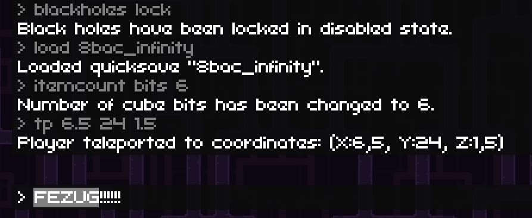

# FEZUG

## Overview 

This library is a [MonoMod](https://github.com/MonoMod/MonoMod) mod which adds some debug functionalities to FEZ - mainly tools for speedrunners, but also for people who want to just mess with the game.

## Features

- Multiple annoying cutscenes (intro, dot loading etc.) shortened or removed.
- Command like (available through `~` key) for interacting with other features.
- Binding feature allowing you to have any command bound to any key through `bind` command.
- `warp` command for moving to different levels instantaneously.
- `reload` command for quick reload of the level you're currently in.
- `save` and `load` commands for saving and loading named quicksaves.
- `progress` command for manipulating game and level progress (WIP)
- `itemcount` command for changing amount of items currently possessed.
- `blackholes` command for manipulating black holes.
- `time` command for manipulating in-game day and night cycle.
- Basic HUD for displaying player's position, velocity and state (WIP)
- `allow3d` command for allowing 3D perspective shift in a level.

## Installation

1. Download [MonoMod](https://github.com/MonoMod/MonoMod/releases) (for .NET 4.5.2) and unpack it in the game's directory.
2. Download FEZ.FEZUG.mm.dll and put it in the game's directory.
3. Run command `MonoMod.exe FEZ.exe` (or drag `FEZ.exe` onto `MonoMod.exe`). This should generate new executable file called `MONOMODDED_FEZ.exe`.
4. Run `MONOMODDED_FEZ.exe` and enjoy your skin!

## Building

1. Clone repository.
2. Copy all dependencies listed in `Dependencies` directory and paste them into said directory.
3. Build it. idk. it should work.
