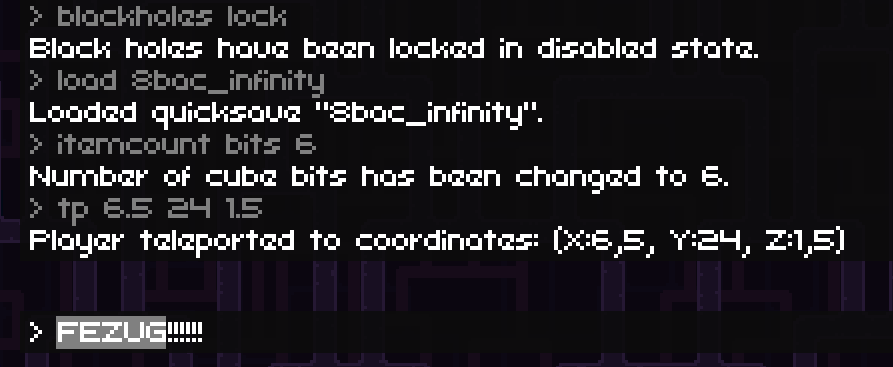

# FEZUG

## Overview

This is a [HAT](https://github.com/Krzyhau/HAT) mod which adds some debug functionalities to FEZ - mainly tools for speedrunners, but also for people who want to just mess with the game.

## Features

- Multiple annoying cutscenes (intro, dot loading etc.) shortened or removed.
- Command like (available through `~` key) for interacting with other features.
- Binding feature allowing you to have any command bound to any key through `bind` command.
- `warp` command for moving to different levels instantaneously.
- `reload` command for quick reload of the level you're currently in.
- Quicksave functionality through `save` and `load` commands.
- Commands for quick inventory manipulation (`itemcount`, `maps` and `artifacts`).
- `progress` command for manipulating game flags and level progress (WIP)
- `blackholes` command for manipulating black holes.
- Timescale manipulation through `timescale` command.
- Invisible trile wireframe preview using `hiddentrileswireframe` command.
- Configurable IL timer (`timer` command).
- Basic HUD for displaying player's position, velocity and state (WIP).

## Installation (0.1.4+)

1. Download and install [HAT](https://github.com/Krzyhau/HAT).
2. Download `FEZUG.zip` and put it in `Mods` directory.
3. Run HAT and enjoy practising!

## Building

1. Clone repository.
2. Edit `UserProperties.xml` file:
    1. Remove the line with `UserPropertiesNotSetUp` tag.
    2. Within `FezDir` tag, insert path to a FEZ game directory (the one which contains `FEZ.exe`).
    3. Within `MomoModDir`, insert path to MonoMod. If you have HAT installed, it should be under `HATDependencies\MonoMod\` in your FEZ game directory.
    4. Optionally, set a path to where the mod files should be copied to (for instance, `Mods/FEZUG` in your FEZ game directory with HAT installed). By default, it'll build into `out` directory of a project.
3. Build the project using your IDE of choice or `dotnet build`.
